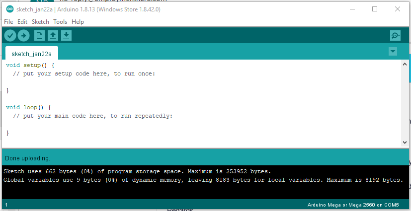

# LoRa Shield Guide
This guide is designed to help beginners set up an Arduino with a Dragino LoRa shield and connect to The Things Network.

## What you will need
To follow this guide, you will need the following:
- An [Arduino Uno](https://www.jaycar.com.au/duinotech-uno-r3-development-board/p/XC4410) or [Arduino Mega](https://www.jaycar.com.au/duinotech-mega-2560-r3-board-for-arduino/p/XC4420)
- A [Dragino LoRa Shield](https://www.jaycar.com.au/arduino-compatible-long-range-lora-shield/p/XC4392) for the Arduino
- A computer to connect to the Arduino and write the code
- A USB A to USB B cable to connect the Arduino to your computer

You will also need to be in range of a Gateway connected to The Things Stack which you can find out about [here](https://www.thethingsnetwork.org/community).

## Step 1 - Physical Setup
To set up the device, attach the LoRa Shield to the Arduino, attach the antenna to the LoRa Shield, and plug the Arduino into your computer.

1. First attach the LoRa Shield to the Arduino by slotting the shields bottom pins into the Arduino ports, ensuring that the pins labels on the shield match with the port labels on the Arduino (e.g. the GND pin on the shield enters the GND port on the Arduino).
2. Now take the antenna that came with the LoRa Shield and attach it.
3. Finally, use the USB port on the Arduino and the USB cable to connect to a computer. *(You should see some little LED's light up on the Arduino and the LoRa shield).*


## Step 2 - Setting up the Environment
### Install Arduino IDE
To get started you will first need to install the Arduino IDE which can be downloaded [here](https://www.arduino.cc/en/software).

After downloading the appropriate option for your system, run the installer and complete the installation process.

Once the program is done installing, open the Arduino IDE.

### Choose Board and Port
Now that we are in the Arduino IDE, select the type of board you are using. To do this, Navigate to `Tools -> Board: <...>`and then select the board that you are using (e.g., 'Arduino Uno' or 'Arduino Mega or Mega 2560')


Now that the board has been correctly selected, we need to select the COM port the computer will use to communicate with the Arduino. To do this, Navigate to `Tools -> Port: <...>` and then select the COM port for the board you're using.

> *If multiple Arduinos are plugged into the computer, they will each have their own COM Port.*

> *TIP: If there's a few options there or you're not sure:*
> 1. *Make a note or take a screenshot of the choices.*
> 2. *Unplug the Arduino from the computer and check to see which one disappeared from the list.*
> 3. *Plug the Arduino back into the computer, notice the choice will reappear in the list.*
> 4. *Select that COM port you now know is associated with the Arduino.*


At this stage you can now upload a program to the Arduino, and it's a good idea to do so and check your setup is working. We will upload the 'blank template' to the Arduino to test. To do this click the `upload` button (the right-facing arrow next to the tick). This will compile, and upload the program to the Arduino. If successful you should see a 'Done uploading' message.



### Install & Configure Library for LoRa Shield
Install a library to help use the LoRa Shield to connect to The Things Stack.

1. First, open the library manager by going to `Tools -> Manage Libraries`
2. Next, in the bar at the top of the window search for `MCCI LoRaWAN LMIC library` and install the library with the same name.
3. When the install is finished, click close at the bottom of the window


Now that we have the library installed, configure it to the Australian standard.

1. Open the Arduino libraries folder (by default this will be in `Documents/Arduino/libraries`)
2. Open `MCCI_LoRaWAN_LMIC_library > project_config > lmic_project_config.h` in notepad or another code editor
3. In the file add `//` before the `#define CFG_us915 1` line and remove `//` from the start of the `//#define CFG_au915 1` to change the region
4. Save the file

*After these changes, the code should look similar to the following:*

```C++
// project-specific definitions
//#define CFG_eu868 1
//#define CFG_us915 1
#define CFG_au915 1
//#define CFG_as923 1
// #define LMIC_COUNTRY_CODE LMIC_COUNTRY_CODE_JP	/* for as923-JP */
//#define CFG_kr920 1
//#define CFG_in866 1
#define CFG_sx1276_radio 1
//#define LMIC_USE_INTERRUPTS
```

The library has now been added & configured. Now to connect to The Things Stack.

## Step 3 - Setup on The Things Stack
Now that our environment is set up, we can prepare to connect it to The Things Stack by following the steps below.

1. Sign in to [The Things Stack](https://eu1.cloud.thethings.network/oauth/login?)
    - Or create an account if you don't have one at [The Things Network](https://account.thethingsnetwork.org/register)
1. Go to the console by clicking on the `Go to the Console` button.
1. Select the `Australia 1` option if asked to select a cluster
1. Select `Go to applications`.
1. Choose an existing application if you already have one you'd like to use, or select add application.
    - If making a new application. Fill out the application ID with a unique name, add a Description and press `create application`.
1. Press the `Add end device` button in the end devices section.
1. Press the 'Manually' tab
1. Set the LoRaWAN version to 'MAC V1.0.2'
1. Click `Start`
1. Enter a unique name for the device ID.
1. Press the `fill with zeros` button next to the AppEUI field
1. Click the `Generate` button next to the devEUI field
1. Give your device a name and description
1. Click `Network layer setting`.
1. Set the Frequency plan as `Australia 915-928 MHz, FSB 2`
1. Set the Regional Parameters version to `PHY V1.0.2 REV B`
1. Click `Join settings`
1. Click the Generate button next to the AppKey field
1. Click the `Add End Device` button

> Your device will now be registered and is ready to connect


We are now be on a page which includes a device overview. Information on this page will be used to configure the Arduino to connect and Authenticate with The Things Stack.


## Step 4 - Connecting the Arduino to The Things Stack
Now that a device is registered on The Things Stack all that is left to do is configure the Arduino with that registration.

In the Arduino IDE Navigate to `File -> Examples -> MCCI LoRaWAN LMIC library > ttn-otaa` which will open a new window.


In the code that has just been opened in the new window, we will need to change 4 things:
1. APPEUI
2. DEVEUI
3. APPKEY
4. Pin mapping

The APPEUI, DEVEUI, APPKEY come from the Device Overview that you created in Step 3 - Setup on The Things Stack.

You will need these values in array format. do this by clicking the angle brackets '<>'. The codes should now be within curly brackets.

For APPEUI and DEVEUI **ONLY** they need to be expressed as little-endian. Do this by clicking the double arrow, *(right beside the angle brackets '<>')*.  The text 'lsb' will be visible indicating that the **l**east **s**ignificant **b**it is first.


1. Change the `APPEUI` to the `Application EUI` from your The Things Stack Device Overview: _Replace the `FillMEIN` section of the following Arduino code
 `static const u1_t PROGMEM APPEUI[8]= { FILLMEIN };`_
2. Change the DEVEUI to the `Device EUI` from The Things Stack Device Overview _Replace the `FillMEIN` section of the following Arduino code `static const u1_t PROGMEM DEVEUI[8]= { FILLMEIN };`_
3. Change the APPKEY to the `App Key` from your The Things Stack Device Overview _Replace the `FillMEIN` section of the following Arduino code `static const u1_t PROGMEM APPKEY[16] = { FILLMEIN };`_
4. Change the section that is labelled `Pin mapping` to the following code:
```C++
// Pin mapping for Dragino LoRashield
const lmic_pinmap lmic_pins = {
    .nss = 10,
    .rxtx = LMIC_UNUSED_PIN,
    .rst = 9,
    .dio = {2, 6, 7},
};
```


Now everything is set up for connecting to The Things Stack:
* Make sure that the serial monitor is closed
* Click the arrow in the upper left corner to upload the code to the Arduino
* After waiting for the code to upload you can now open the Serial Monitor through `Tools > Serial Monitor` and see the output.
* After the Serial Monitor is opened, in the bottom right section of the serial window set the dropdown to `9600 baud`

If everything went well it should post a Successful transmission every 60 seconds which you will also be able to see on The Things Stack website in the device data section.

*Don't be worried if it fails to connect a few times*


## Step 5 - Customising Your Message
Right now the example code is sending the hex encoded message for `Hello, world!` which can be seen as `48 65 6C 6C 6F 2C 20 77 6F 72 6C 64 21` in The Things Stack Data tab.

We can change this to something else by changing the text in the line `static uint8_t mydata[] = "Hello, world!";` in the Arduino IDE.

The time between messages can also be changed by changing the value of the line `const unsigned TX_INTERVAL = 60;` in the Arduino IDE.
